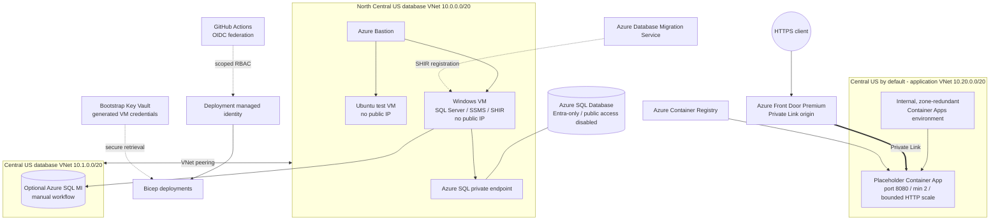

# Lab 04 requirements

These are the Lab 04 requirements for the Azure foundation. Use the Required Final
Architecture and the Non-Negotiable Requirements below as the minimum design for
the Bicep you plan and generate under `infra/lab04/student/`. The known-good
implementation is in [`complete/`](./complete/README.md).

## 🏗️ Required Final Architecture

> [!IMPORTANT]
> **This is a workshop architecture, not a universal production reference
> architecture.** Some topology, region, SKU, service-boundary, and access
> decisions were selected to fit lab time, cost, subscription limits, and the
> learning sequence. For a production implementation, evaluate an
> [Azure landing zone](https://learn.microsoft.com/azure/cloud-adoption-framework/ready/landing-zone/)
> as the platform baseline for governance, identity, security, connectivity,
> management, and workload subscriptions. Then review the workload against the
> [Azure Well-Architected Framework](https://learn.microsoft.com/azure/well-architected/)
> and your organization's requirements. Networking and architecture decisions
> must be thoroughly reviewed for reliability, resiliency, security, cost,
> operational excellence, performance, failure modes, and recovery objectives
> before deployment.

### Network baseline

| VNet | Region | Address space | Purpose |
| --- | --- | --- | --- |
| Primary database | North Central US | `10.0.0.0/20` | Bastion, VMs, Azure SQL private endpoint |
| Secondary database | Central US | `10.1.0.0/20` | SQL Managed Instance delegated subnet |
| Application | Central US by default | `10.20.0.0/20` | Internal, zone-redundant Container Apps environment |

The application location remains a parameter. Select a region that supports Availability Zones before deployment; Central US is the known-good default because North Central US does not support the required zonal configuration. Do not add a subnet named `default`. Give each subnet one clear purpose, verify current service delegation and minimum-size requirements, and leave growth space.

## 🔒 Non-Negotiable Requirements

Your plan and implementation must:

- place both VMs in the primary database VNet and assign neither a public IP
- use Azure Bastion for browser-based RDP and SSH
- place SQL MI in its own delegated subnet in the peered secondary database VNet
- disable Azure SQL public network access and use Private Link and private DNS
- use one internal, zone-redundant workload-profile Container Apps environment in a dedicated application VNet
- expose the single application origin through Front Door Premium and Private Link
- run at least two placeholder-app replicas and use a bounded HTTP scaling rule
- use a Microsoft sample image on port `8080`; do not deploy the workshop application code
- use GitHub Actions OIDC, not a client secret
- scope the deployment identity to the lab resource groups
- use managed identities and deterministic, narrowly scoped role assignments
- store generated VM credentials in Key Vault and never print or commit them
- keep SQL MI in a separate manual workflow
- parameterize names, locations, CIDRs, SKUs, capacity, and required tags
